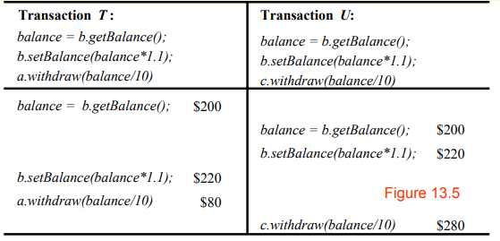
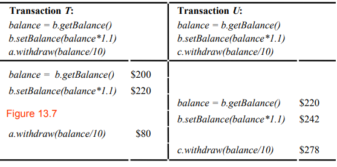
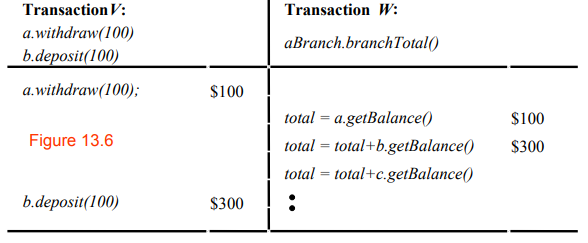
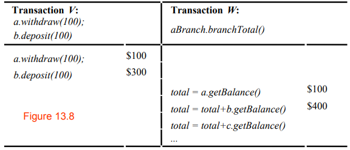
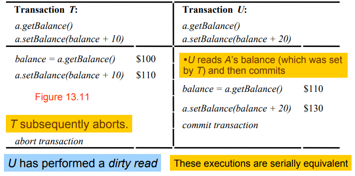
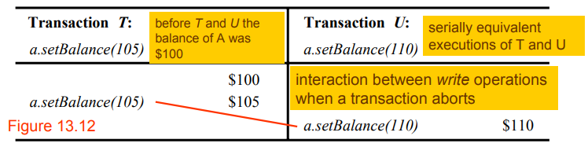

## Transaction and Concurrency Control

### Transaction
> A transaction is a logical unit of processing in a DBMS which entails one or more database access operation.

> A transaction is a program unit whose execution may or may not change the contents of a database.

A transaction defines a sequence of server operations guaranteed to be atomic in the presence of multiple clients and server crash.

### Concurrency Control
All concurrency control protocols are based on serial equivalence and are derived from rules of conflicting operations.

- Locks are used to order transactions that access the same object according to request order.

- Optimistic concurrency control allows transactions to proceed until they are ready to commit, where-upon a check is made to see if any conflicting operation on objects is present.

- Timestamp ordering uses timestamps to order transactions that access the same object according to the their start time.

### A.C.I.D Properties

#### Atomicity

> Atomicity: A series of operations that cannot occur partially. It can either occur fully or not occur at all.

All or nothing: a transaction either completes successfully, and effects of all of its operations are recorded in the object, or it has no effect at all.

##### Failure Atomicity
Effects are atomic even when server crashes.

#### Consistency

A transaction takes the system from one consistant state to another consistant state.

#### Isolation: 
Each transaction must be performed without interference from other transactions.
The intermediate effects of a transaction must not be visible to other transactions.

#### Durability
After a transaction has completed successfully, all its effects are saved in permanent storage for recover later
 

---
### The Banking Example

- Each account is represented by a remote object whose interface **Account** provides operations for making deposits and withdrawals and for enquiring about and setting the balance.

> Each account has a set of Methods that can be called to do certain operations.

- Each branch of the bank is represented by a remote object whose interface **Branch** provides operations for creating a new account, for looking up an account by name and for enquiring about the total funds at that branch.

> Each account has a set of Methods that can be called to do certain operations.

- **The Problem:** Unless a server is carefully designed, its operations performed on behalf of different clients may sometimes interfere with one another. Such interference may result in incorrect values in the object. 

#### Methods

_Account Methods_

- _**deposit(amount)**_: deposit amount in the account.
- _**withdraw(amount)**_ :withdraw amount from the account.
- _**getBalance() -> amount**_ : return the balance of the account.
- _**setBalance(amount)**_ : set the balance of the account to amount.

_Branch Methods_

- _**create(name) -> account**_ : create a new account with a given name
- _**lookUp(name) -> account**_ : return a reference to the account with the given name
- _**branchTotal() -> amount**_ : return the total of all the balances at the branch

#### Example of a Banking Transaction of a client

Transaction T:

`a.withdraw(100);`
`b.deposit(100);`

---

### Concurrent Transactions

Two well known problems of concurrent transactions in the context of the above example are:

1. The `Lost Update` Problem
2. The `Incosistent Retrievals` Problem

#### The Lost Update Problem

>In the lost update problem, update done to a data item by a transaction is lost as it is overwritten by the update done by another transaction.

##### Problem solved - Interleaved

#### The Inconsistent Retrievals Problem

>Inconsistent Retrievals Problem is also known as unrepeatable read. When a transaction calculates some summary function over a set of data while the other transactions are updating the data, then the Inconsistent Retrievals Problem occurs.

##### Problem solved - Interleaved

---

#### Serial Equivalence

If each one of a set of transactions has the correct effect when done on its own  then if they are done one at a time in some order the effect will be correct.

>A serially equivalent interleaving is one in which the combined effect is the same as if the transactions had been done one at a time in some order

Combined Effect is same meaning,
- the read operations return the same values
- the instance variables of the objects have the same values at the end

**Conflicting Operations** are when the combined effect _depend on_ the order which they are executed. (Read and Write)

Three ways to ensure serializability:
- Locking
- Timestamp ordering
- Optimistic concurrency control

### Recoverablility

Servers must record the effect of all committed transactions and none of the effects of the aborted transactions.

Two problems associated with aborting transactions that may occur in the presence of serially equivalent execution of transactions:
- Dirty reads
- Premature writes

#### Dirty Read

Dirty reads caused by a read in one transaction U and an earlier unsuccessful write in another transaction T on the same object.

T will be rolled back and restore the original a value, thus U will have seen a value that never existed. U is committed, so cannot be undone. U performs a dirty read.

#### Premature writes

some database systems keep ‘before images’ and restore them after aborts.
- e.g. `$100` is before image of `T’s` write, `$105` is before image of `U`’s write
- if `U` aborts we get the correct balance of `$105`,
- But if `U` commits and then
- `T` aborts, we get `$100` instead of `$110`

