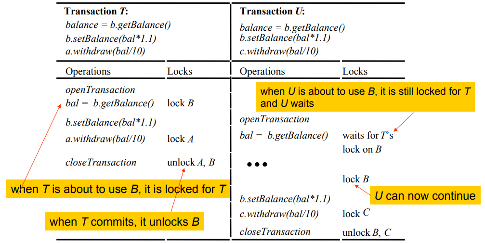
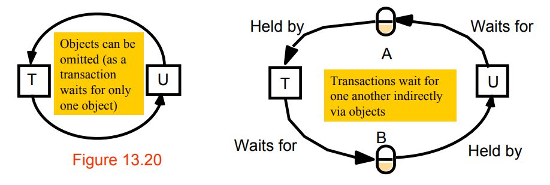

## Ensuring Serialibility

### Locks

Transactions must be scheduled so that their effect on shared objects is serially equivalent
A server can achieve serial equivalence by serialising access to objects, by the use of **locks**

A transaction is not allowed any new locks after it has released a lock.

**Exclusive Locks**

#### Two Phase Locking

Has a ‘growing’ and a ‘shrinking’ phase

#### Strict Two Phase Locking

Strict executions prevent dirty reads and premature writes (if transactions abort).
- A transaction that reads or writes an object must be delayed until other transactions that wrote the same object have committed or aborted.
- To enforce this, any locks applied during the progress of a transaction are held until the transaction commits or aborts.
- This is called **strict two-phase locking**
- For recovery purposes, locks are held until updated objects have been written to permanent storage

#### Lock compatibility

The operation conflict rules tell us that:
1. If a transaction `T` has already performed a **read** operation on a particular object, then a concurrent transaction `U` **must not write** that object until `T` commits or aborts.
2. If a transaction `T` has already performed a **write** operation on a particular object, then a concurrent transaction `U` **must not read or write** that object until `T` commits or aborts.

#### Lock - Working

1. *When an operation accesses an object within a transaction:*
- If the object is not already locked, it is locked and the operation proceeds.
- If the object has a conflicting lock set by another transaction, the transaction must wait until it is unlocked.
- If the object has a non-conflicting lock set by another transaction, the lock is shared and the operation proceeds.
- If the object has already been locked in the same transaction, the lock will be promoted if necessary and the operation proceeds. (Where promotion is prevented by a conflicting lock, rule (b) is used.)
2. *When a transaction is committed or aborted, the server unlocks all objects it locked for the transaction.*
 

#### Deadlocks

>A Deadlock is a state in which each member of a group of transactions is waiting for some other member to release a lock.

>A wait-for graph can be used to represent the waiting relationships between
current transactions

#### Handling Deadlocks

##### Deadlock Prevention

- **Lock all of the objects used by a transaction when it starts**
    - unnecessarily restricts access to shared resources.
    - sometimes impossible to predict at the start of a transaction which objects will be used

- **Requesting locks on objects in a predefined order**
    - but this can result in premature locking and a reduction in concurrency
    
---

##### Deadlock Detection and Resolution

###### By finding cycles in the wait-for graph

Upon detecting a deadlock, a transaction must be selected to be aborted to break the cycle.

> when a cycle is detected, choose a transaction to be aborted and then remove from the graph all the edges belonging to it.

It is hard to choose a victim - e.g. choose the oldest or the one in the most cycles.

##### Lock timeouts can be used to resolve deadlocks
Each lock is given a limited period in which it is invulnerable, after which a lock becomes vulnerable.

**Problems with lock timeouts**
- locks may be broken when there is no deadlock.
- if the system is overloaded, lock timeouts will happen more often and long transactions will be penalised.
-  it is hard to select a suitable length for a timeout.