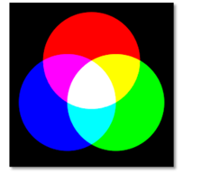
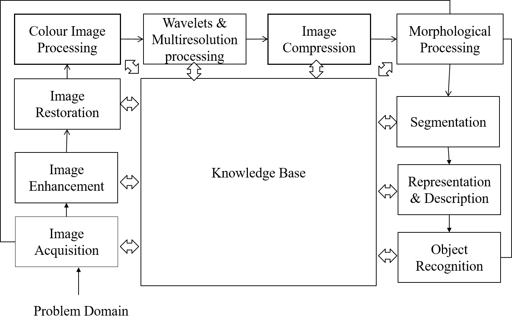

## Introduction to Images

### Image
A two dimensional function **f(x,y)** ,where x and y are spatial co-ordinates and f at any pair of co-ordinates (x,y) is called the intensity or gray level of the image at that point.

#### Analog Images
When above mathematical representation has continuous range of values representing position and intensity, image is an analog image, otherwise it is a digital (discontinous) Image.

#### Digital Images
When x,y and f all are finite, it is called digital image. Contains finite number of elements, each of which has a particular value and location.

These elements are called image elements, pixel elements, pel or pixels.

### Types of images

#### Binary Images

- Simplest form of images.
- Has only 2 types of values 0,1.
- Needs only 1 binary digit to represent a pixel.

#### Gray-scale images

- Most famous image formats.
- Has 2^8 types of values (256 shades)
- The colors in 8 bit vary from 0-255.
    - 0 for Black
    - 255 for White
    - 127 for Gray

#### Colour images

- Three band monochrome images (8 bits x 3 bands) 24 bits/pixel.
    - Red
    - Green
    - Blue
- The color images contain gray level information in each spectral band.

---

## Digital Image Processing

It is the analysis and manipulation of a digitized image, especially in order to improve its quality.

> Digital image processing relates to the manipulation of images using digital computers.

### Fundamental Steps in Digital Image P.

#### Image Acquisition
- Image is captured by a sensor (Camera).
- It is then digitized (converted to digital form) using Analogue-to-Digital Converter

#### Image Enhancement
- Involves manipulating an image to make it more suitable for specific applications (than original image).
- Concept is to highlight hidden or areas of interest in an image.
- Enhancement is Subjective (based on human's concept of a good enhancement).

#### Image Restoration
- Improves the appearance of the image.
- Often uses Mathematical/ Probablistic models.
- Restoration is objective.

#### Colour Image Processing
- Uses colours to extract (areas of interest) features from an image.

#### Wavelets
- It is the foundation of representing images in various degrees of resolution.
- Used for Image (Data) Compression.

#### Compression
- Techniques to reduce the storage required to 
    - save a image or
    - bandwidth required to transmit it.

#### Morphological Processing
- Tools for Extracting Image components, useful for representing and describing the Shape.

- Unlike previous Units (that output Images), this step outputs Image Attributes.

#### Image Segmentation
- Involves partitioning (spliting/joining) an image to its constituent parts or objects.

#### Rugged Segmentation
- Used in for Image Detection Problems when the object needs to be identified individually.

#### Weak or Erratic Segmentation
- ???

#### Representation and Description

##### Representation:
- Makes a 

#### Recognition and Interpretation
- **Recognition:** Assigns labels to an object based on the information provided by its description.

#### Knowledge Base
- Knowledge about a problem domain is coded into an image processing system in the form of a knowledge database. 
- Limits the search that has to be conducted in seeking that information

---

### Components of an Image Processing System

Consists of 8 main parts

1. Image Sensors
2. Specialized Image Processing Hardware
3. Computer
4. Image Processing Software
5. Mass Storage Capability
6. Image Displays
7. Hardcopy devices
8. Networking

#### Image Sensors

- Device to aquire Digital Images
- Comprises of two parts
    - Sensor
    - Digitizer
##### Sensor
Physical Device that is **sensitive** to the energy radiated by the object.

> Sensors can be Image sensors, Infrared sensors etc...

##### Digitizer
A device used for **converting** the output of the sensor **to Digital Form**

#### Specialized Image Processing Hardware

- Usually consists of the **digitizer** and hardware
- performs other primitive operations,like arithmetic and logical operations in parallel on entire images (ALU).
- also known as a front-end subsystem
- performs functions that require fast data throughput.

#### Computer

- A general purpose computer (ranges from a PC to a supercomputer)
- Sometimes, specially designed computers are used for dedicated applications.

#### Image Processing Software

- Software consists of specialized modules that perform specific tasks.

> Converting to grayscale, Determining the resolution are some of the examples of such modules.

- Well designed modules/packages often encourage the user to minimize user code by using the module's built-in functions.

#### Mass Storage Capability

Storage is a necessary part in Image processing Applications.

Images are stored as matrices where each element of the matrix denotes that position's intensity values.

An image of size 1024 x 1024 requires 1 MB of Storage.

> Data Sizes:
8 bits => 1 byte
1024 bytes => 1 kiloByte
1024 kB => 1 megaByte

Digital Storage can be of 3 types
- Short term storage : Used during processing (storing intermediate results).
    - Using frame buffers, caches
- Online Storage : Used for relatively fast recall (fetching).
    - Using Optical and Magnetic Disks
- Archival storage: Used for backup and infrequent accesses.

#### Image Displays

- Monitors outputs the image using the graphics card of the computer.
- Most monitors today are Colour and also flat screen.

#### Hardcopy Devices

Used for recording images, include laser printers, film cameras, heat sensitive devices etc..

#### Networking

- Networking is considered, an integral part of a computer.
- Image transmission often considers the bandwidth required for transmiting the image data.
- Long distance communications can be inefficient, as an alternative, we **use Optical fiber** or other Broadband technologies.

--- 

## Applications of DIP
_Fields that use Digital Image Processing_

- Gamma Rays
    - Bone Pathology
    - Tumor Detection
    - Nuclear Medicine
- X-Rays
    - Medical Diagnostics
    - Astronomy (Telescopes)
    - Angiography
    - Structural Integrity Checking
- Ultraviolet Rays 
    - Microscopy
    - Biological Imaging
    - Lasers
    - Lithography
    - Flurescence microscopy
    - Astronomy (Telescopes and Sensors)
- Visible
    - Microscopy
    - Remote Sensing
    - Security
- Infrared Rays
    - Astronomy
    - Remote Sensing
    - Infrared Photography
    - Meteorology (Weather Dept.)

--- 