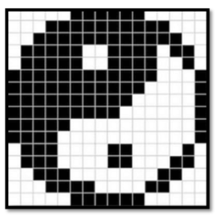

## Introduction to Images

### Image
A two dimensional function **f(x,y)** ,where x and y are spatial co-ordinates and f at any pair of co-ordinates (x,y) is called the intensity or gray level of the image at that point.

#### Analog Images
When above mathematical representation has continuous range of values representing position and intensity, image is an analog image, otherwise it is a digital (discontinous) Image.

#### Digital Images
When x,y and f all are finite, it is called digital image. Contains finite number of elements, each of which has a particular value and location.

These elements are called image elements, pixel elements, pel or pixels.

### Types of images

#### Binary Images

- Simplest form of images.
- Has only 2 types of values 0,1.
- Needs only 1 binary digit to represent a pixel.

#### Gray-scale images

- Most famous image formats.
- Has 2^8 types of values (256 shades)
- The colors in 8 bit vary from 0-255.
    - 0 for Black
    - 255 for White
    - 127 for Gray

#### Colour images

- Three band monochrome images (8 bits x 3 bands) 24 bits/pixel.
    - Red
    - Green
    - Blue
- The color images contain gray level information in each spectral band.

---

## Digital Image Processing

It is the analysis and manipulation of a digitized image, especially in order to improve its quality.

> Digital image processing relates to the manipulation of images using digital computers.

### Fundamental Steps in Digital Image P.

#### Image Acquisition
- Image is captured by a sensor (Camera).
- It is then digitized (converted to digital form) using Analogue-to-Digital Converter

#### Image Enhancement
- Involves manipulating an image to make it more suitable for specific applications (than original image).
- Concept is to highlight hidden or areas of interest in an image.
- Enhancement is Subjective (based on human's concept of a good enhancement).

#### Image Restoration
- Improves the appearance of the image.
- Often uses Mathematical/ Probablistic models.
- Restoration is objective.

#### Colour Image Processing
- Uses colours to extract (areas of interest) features from an image.

#### Wavelets
- It is the foundation of representing images in various degrees of resolution.
- Used for Image (Data) Compression.

#### Compression
- Techniques to reduce the storage required to 
    - save a image or
    - bandwidth required to transmit it.

#### Morphological Processing
- Tools for Extracting Image components, useful for representing and describing the Shape.

- Unlike previous Units (that output Images), this step outputs Image Attributes.

#### Image Segmentation
- Involves partitioning (spliting/joining) an image to its constituent parts or objects.

#### Rugged Segmentation
- Used in for Image Detection Problems when the object needs to be identified individually.

#### Weak or Erratic Segmentation
- ???

#### Representation and Description

##### Representation:
- Makes a 

#### Recognition and Interpretation
- **Recognition:** Assigns labels to an object based on the information provided by its description.

#### Knowledge Base
- Knowledge about a problem domain is coded into an image processing system in the form of a knowledge database. 
- Limits the search that has to be conducted in seeking that information

---

### Components of an Image Processing System