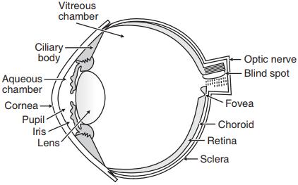
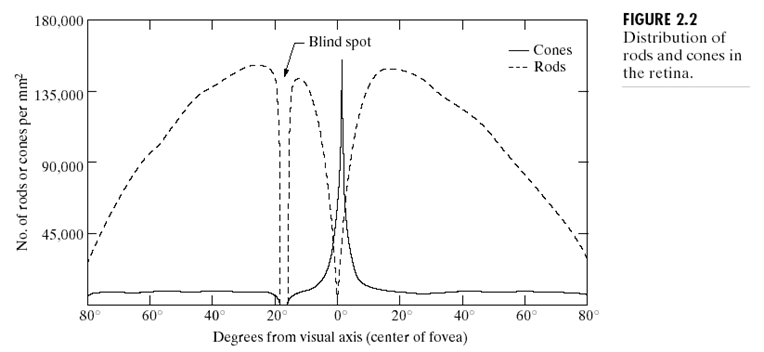
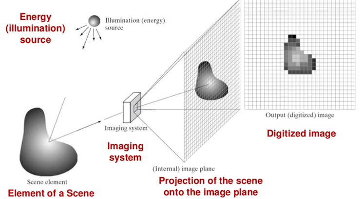

## Fundamentals of DIP

### Human Visual System

The human visual system consists of two parts: eye and brain. The human eye acts as a receptor of images by capturing light and converting it into signals.

Eyes and brain work in combination to form a picture. The human eye is analogous to a camera.

#### Cornea
- Tough transparent tissue that covers the anterior (nearer the front) surface of the eye.

- Succeded by  the **Sclera** an opaque membrane that encloses the remainder of the optic globe.

#### Choroid

- Contains blood vessels for eye nutrition
- Heavily pigmented to reduce extraneous light entrance and backscatter.
- divided into 
    - the ciliary body and 
    - the iris diaphragm

#### Lens

- Made up of fibrous cells
- Suspended by fibers attached to the Ciliary Body.
- Slightly yellow (absorbs 8% of visible light).

#### Retina 

- provides a photo-sensitive screen at the back of the eye.
- lines the entire posterior of the eye.
- Contains discrete light receptors are distributed over the surface .
    - Cones 
    - Rods

##### Cones

- Located in the fovea
- Sensitive to color.
- Each one is connected to its own nerve end.
- Cone vision is called photopic (bright-light vision).

##### Rods

- Gives overall picture of the field of view.
- Several rods are connected to a single nerve and are sensitive to low levels of illumination
- Rod vision is called scotopic (dim-light vision)

#### Fovea 

- Small Circular region of the retina that contains a large number of photo-sensitive cells and provides very good resolution.
- Can be assumed to be a square sensor array (1.5mm x 1.5mm)
- Density of Cones: 150k $elements/mm^2$

The absence of receptors results in Blind-spot, as seen in the figure.
- Cones are most dense in the center of the fovea.
- Rods increase in density from the center out to approximately 20% off axis and then decrease.

• Optic nerve: These nerves carry the signals generated by the retina to the
brain.

### Simple Image Formation Model

#### Image

An image can be represented by a function of intensities for each pixel. `F (x,y)`

The Function `F (x,y)` represents a 2D image.
The image stores the energy intensity values that is radiated by the physical source.

So `F (x,y)` ranges from `0` to `Infinity`

`0   < F (x,y) < Infinity`

The Intensity of an Image (2D) is determined by two main components:

#### Illumination
The amount of light energy that falls on the object. It is denoted by `i(x,y)`

#### Reflectance
The amount of light reflected by the objects in the scene. It is denoted by `r(x,y)`

Therefore,

`0 < i(x,y) < Infinity`
`0 < r(x,y) < Infinity`

The values of `i` and `r` are theoretical values.

From total Absorption (0) to total Reflectance (1).

